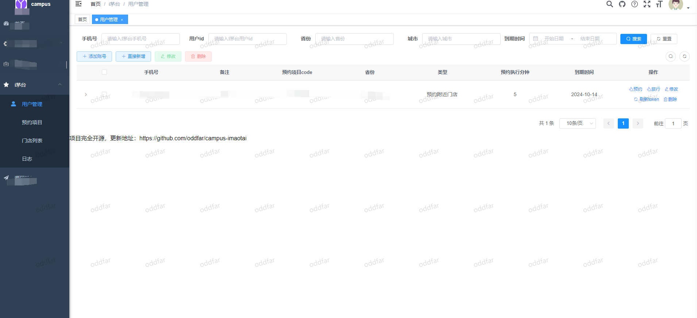
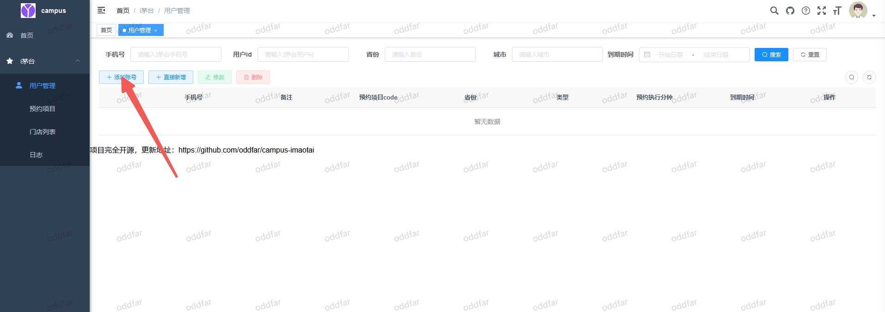
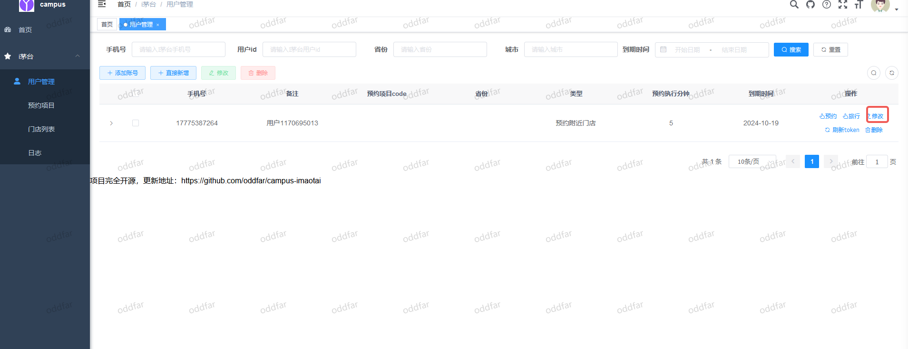
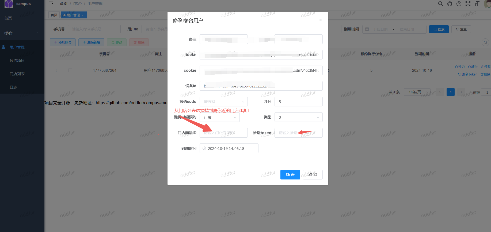
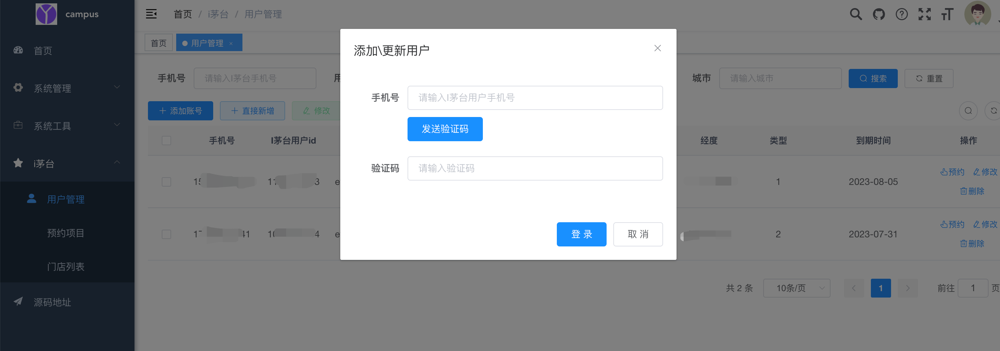
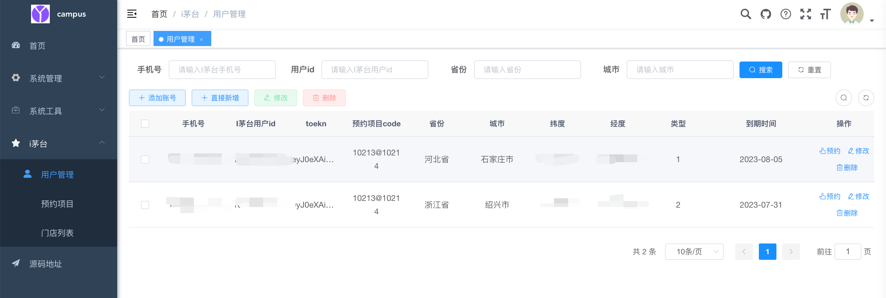
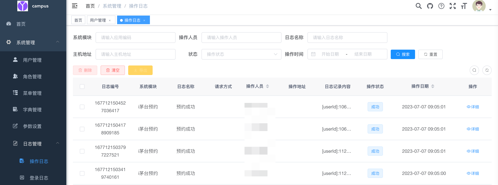
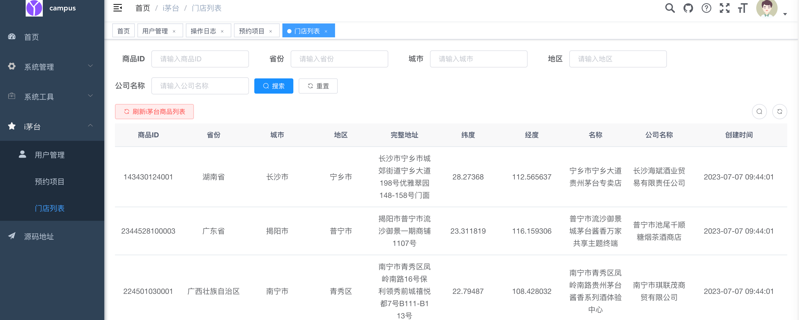
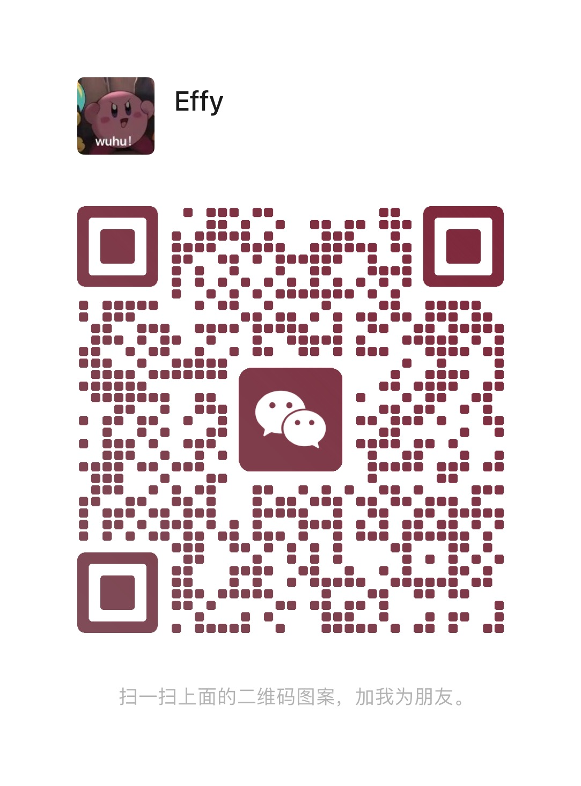

## i茅台免费预约网站
http://hangyejingling.cn:10081
### 以下账号不要改密码 一旦更改 账号就直接删掉。大家共享。
账号:test
密码:123456

账号:test1
密码:123456

账号:test2
密码:123456

## 使用方式：
### 1、添加账号

p.s 添加的账号需要预先在imaotai App实名认证过

### 2、配置自动预约

推送token 通过 https://www.pushplus.plus/
``
这个网站获取，就是关注【pushplus推送加】公众号，发送token获取到token填上
``
## 常见问题
#### 1、门店ID怎么填？
A：门店ID从门店列表页获取 找到你对应的城市的商店，把商店ID填进去

## 基于https://github.com/oddfar/campus-imaotai搭建的。一个人用太浪费，大家一起用吧
## 效果图：
## 需要独享账号的联系方式：
## 纯公益，抢到的请喝杯咖啡。大家点个 star吧谢谢
